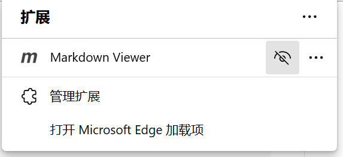
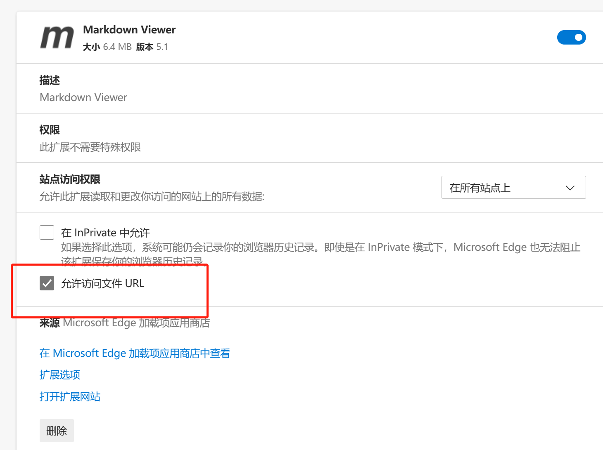

### 前言
  🌟 适用版本Python 3.9.5(写笔记的时候适用版本就是3.9.5，只要版本不低都可以)，内设Java笔记(清欢栏目)

  🌟 Python的.md文件还请clone后，使用markdown查看，或者使用edge的插件
    

    
  
  🌟 "一群不正经的测试会写一些实用的笔记"

  🌟 也有学习群聊，欢迎来访！
  
### 介绍
  🌟 主要是一些实践学习笔记，非八股文系列！
  
  🌟 使用工具：Pycharm、Vscode、Idea等

### 参与贡献
  🌹 作者：清安、清欢、RAIN
  
  🌹 微信：qing_an_an
  
  🌹 公众号：测个der
  
  🌹 CSDN：https://blog.csdn.net/weixin_52040868
